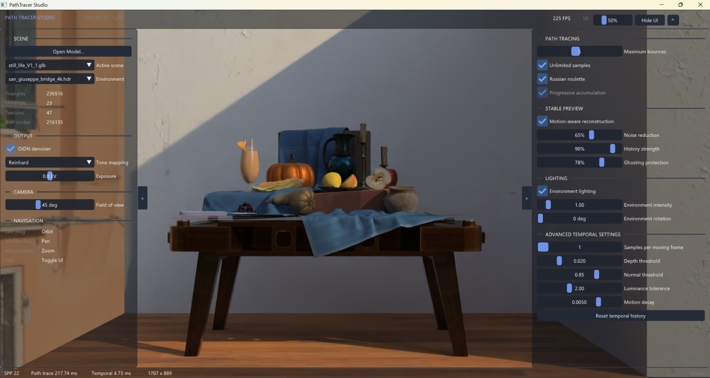
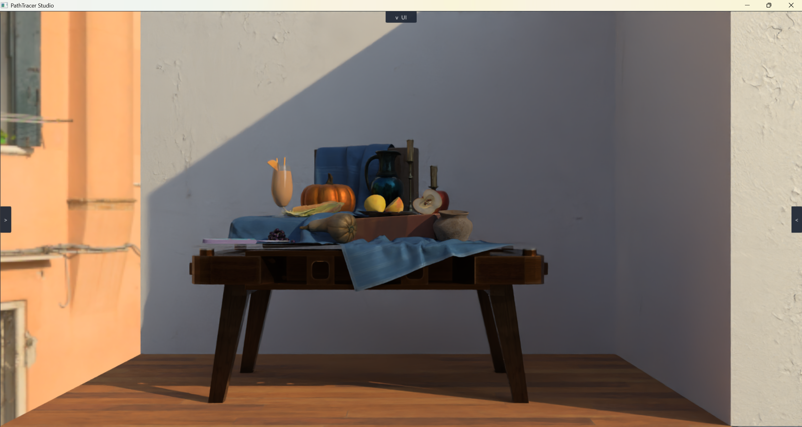
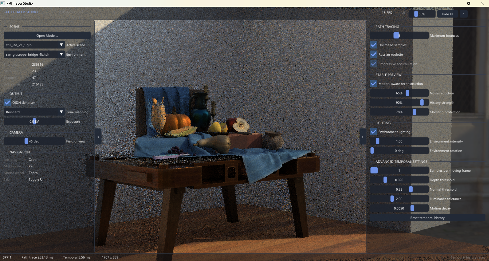
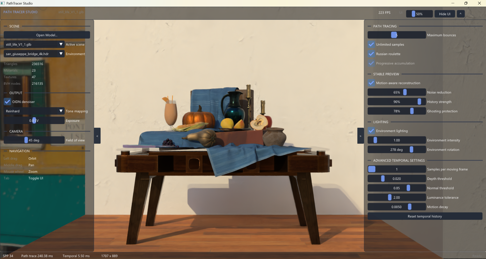
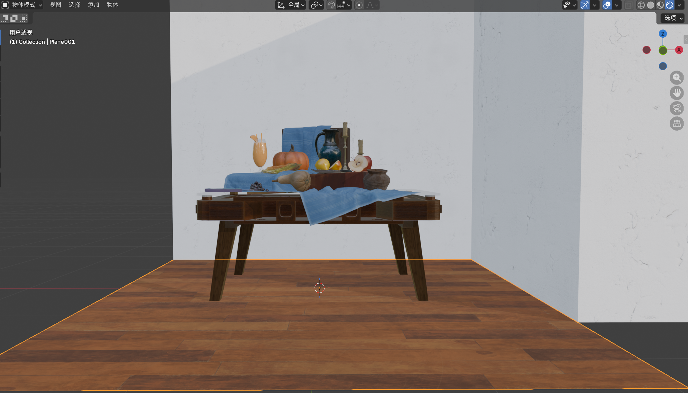

# PathTracer Studio

An interactive GPU path tracing renderer built with **C++**, **OpenGL**, and **GLSL**.
The project implements physically based light transport through conventional OpenGL fragment-shader passes—without relying on a dedicated hardware ray-tracing API—and combines it with a motion-aware temporal reconstruction pipeline for a more stable interactive camera experience.

`C++` · `OpenGL 3.3` · `GLSL` · `GPU Path Tracing` · `BVH` · `PBR` · `Temporal Reconstruction` · `Dear ImGui`



## Project Overview

PathTracer Studio explores how an offline-style path tracer can be turned into an approachable interactive application. The system separates CPU-side scene preparation from GPU-side light transport: C++ handles model loading, camera interaction, material data, BVH construction, and UI state, while GLSL shaders perform ray traversal, path sampling, temporal reconstruction, and display processing. A transparent, collapsible interface keeps the rendered scene visible while exposing the parameters that most strongly affect quality, stability, and performance.

This project was independently designed and implemented as an end-to-end graphics application. Third-party libraries are used for platform integration, UI, asset loading, and optional denoising; the rendering pipeline, interaction design, temporal controls, and application integration form the core project work.

## Core Features

### GPU Path Tracing

- Monte Carlo light transport implemented in OpenGL fragment shaders.
- Global illumination, soft shadows, glossy reflection, refraction, metallic response, and glass transmission.
- Direct-light sampling, multiple importance sampling, and Russian roulette termination.
- Progressive multi-frame accumulation for converging from an interactive preview to a cleaner image.

### Scene Acceleration and Asset Pipeline

- Two-level acceleration structure with mesh-level BLAS and scene-level TLAS organization.
- CPU-built BVH data flattened into GPU-readable buffers for stack-based shader traversal.
- OBJ, glTF, and GLB scene loading with multi-material and texture support.
- Runtime model selection, HDR environment switching, and scene statistics including triangles, materials, textures, and BVH nodes.

### Physically Based Shading and Lighting

- Disney-style physically based material sampling.
- HDR environment lighting with adjustable intensity and rotation.
- ACES, Reinhard, and linear output modes with exposure adjustment.
- Optional Intel Open Image Denoise integration for final-image cleanup.

### Motion-Aware Stable Preview

Camera motion creates a difficult trade-off: discarding history produces heavy Monte Carlo noise, while reusing too much history creates ghosting. The stable-preview pipeline reprojects previous-frame information and estimates its reliability using geometric and image-space evidence.

- Depth and normal consistency reject invalid history near disocclusions and object boundaries.
- Motion magnitude reduces reuse when camera movement becomes faster.
- Luminance difference identifies unstable or newly revealed regions.
- Neighborhood clamping limits outdated color values before temporal blending.
- Adjustable history strength, ghosting protection, moving-frame samples, and confidence thresholds expose the quality–responsiveness trade-off.

The renderer also includes a deterministic camera-path experiment harness for comparing fixed temporal reuse, geometry-guided rejection, and the complete confidence-guided method under equal sampling conditions. See [`research/README.md`](research/README.md) for the experimental workflow.

### Interaction and Interface Design

- Scene-first layout with transparent side panels that preserve visual focus on the render.
- Independently collapsible left, right, top, and status panels.
- Adjustable UI opacity and one-click distraction-free viewing.
- Real-time controls for path depth, sample limits, temporal behavior, lighting, tone mapping, denoising, and field of view.
- Fixed-width performance readout for stable FPS and timing display.

## Gallery

| Final render | Moving-camera preview |
|---|---|
|  |  |

| Alternative lighting | Test scene |
|---|---|
|  |  |

## System Architecture

```text
OBJ / glTF / GLB + textures + HDR environment
                    │
                    ▼
      C++ scene parsing and material processing
                    │
                    ▼
          BLAS / TLAS BVH construction
                    │
                    ▼
       Flattened GPU buffers and textures
                    │
                    ▼
      GLSL path tracing and light sampling
                    │
                    ▼
 Motion-aware temporal reconstruction / accumulation
                    │
                    ▼
       Denoising, tone mapping, and presentation
```

## Download and Run

The recommended way to try the project is to download the portable Windows package from the [latest GitHub Release](https://github.com/zhD1dqz/GPU-PathTracingRenderer/releases/latest).

1. Download `PathTracerStudio-Portable.zip`.
2. Extract the **entire** archive to a normal folder.
3. Double-click `PathTracerStudio.exe`.
4. If the launcher is unavailable, use `Launch.bat` as a fallback.

Visual Studio is **not** required to run the portable package.

### System Requirements

- Windows 10 or Windows 11, 64-bit.
- A GPU and graphics driver supporting OpenGL 3.3 or later.
- A supported 64-bit CPU for Intel Open Image Denoise.
- Sufficient GPU memory for the selected model, textures, BVH data, and temporal buffers.

## Controls

### Mouse and Interface

| Control | Action |
|---|---|
| Left mouse drag | Orbit the camera |
| Middle mouse drag | Pan the camera |
| Mouse wheel | Zoom |
| Edge arrow buttons | Collapse or restore a side panel |
| Top arrow | Collapse or restore the top bar |
| UI slider | Adjust panel opacity |
| `Hide UI` or `Tab` | Enter or leave distraction-free view |

### Keyboard Shortcuts

| Key | Action |
|---|---|
| `Ctrl + S` | Save the current frame to the `captures` folder |
| `1`–`9` | Switch between available scenes |
| `E` | Switch environment maps |
| `R` | Toggle Russian roulette |
| `T` | Toggle tone mapping |
| `M` | Toggle environment lighting |
| `A` | Toggle ACES tone mapping |
| `Y` | Toggle the motion-aware stable preview |
| `+` / `-` | Adjust environment intensity |
| `Alt +` / `Alt -` | Rotate the environment map |
| `Shift +` / `Shift -` | Adjust the sample limit |
| `Ctrl +` / `Ctrl -` | Adjust maximum path depth |

## Important Notes

- **Extract before running.** Do not launch the executable from inside the ZIP archive.
- **Keep the folder structure unchanged.** The launcher, `bin`, `assets`, and `src/shaders` directories use relative paths and must remain together.
- **Initial noise is expected.** Progressive path tracing begins with a low sample count and becomes cleaner while the camera remains still.
- **Camera movement changes temporal history.** The stable-preview system reuses only confidence-weighted history; newly revealed regions may need several frames to converge.
- **Performance is scene-dependent.** Resolution, path depth, moving-frame samples, material complexity, and BVH size all affect frame time.
- **Update the graphics driver if startup fails.** OpenGL support is provided by the installed GPU driver.
- **Windows SmartScreen may warn about the unsigned launcher.** Confirm that the archive came from this repository before choosing to run it.
- **Large models require patience.** Scene parsing, texture upload, and BVH construction can make the first load slower than subsequent interaction.

## Build from Source

### Prerequisites

- Windows 10/11.
- Visual Studio 2019 or 2022 with **Desktop development with C++**.
- Windows 10 SDK.
- An OpenGL 3.3-capable graphics driver.

### Build Steps

1. Clone or download this repository.
2. Open `PathTracerRenderer.sln`.
3. Select `Release` and `x64`.
4. Build `PathTracerRenderer`.
5. Run the generated executable from the project layout so that relative asset and shader paths remain valid.

The required source dependencies are included under `thirdparty`. The project uses the Visual Studio `v143` toolset for the current Release x64 configuration; older configurations may require `v142`.

To regenerate the portable package after a successful build:

```powershell
.\make_portable_release.ps1
```

The archive is generated at `release/PathTracerStudio-Portable.zip`. Upload that archive as a GitHub Release asset rather than committing it to the source history.

## Repository Structure

```text
assets/          Demo model and HDR environment map
images/          README and portfolio screenshots
packaging/       Portable launcher fallback and user instructions
research/        Reproducible temporal-reconstruction evaluation scripts
src/core/        Renderer, scene, camera, material, and GPU resource logic
src/loaders/     OBJ and glTF/GLB loading
src/math/        Vector, matrix, and math utilities
src/shaders/     Path tracing, temporal, output, and material GLSL shaders
thirdparty/      External libraries used by the project
tools/           Research UI and launcher build utilities
```

## Third-Party Components and Assets

The repository includes or integrates Dear ImGui, SDL2, OpenGL/gl3w, Intel Open Image Denoise, RadeonRays, stb, tinydir, tinygltf, and tinyobjloader. Each third-party component remains subject to its own license and attribution requirements.

The demonstration model and HDR environment are included for project presentation. Their original authorship and redistribution terms should be documented before the repository is treated as a reusable asset package.

## License Status

A repository-level open-source license has not yet been selected. Unless a future `LICENSE` file states otherwise, the project is published for portfolio and educational review; third-party code and assets retain their respective licenses and ownership.
